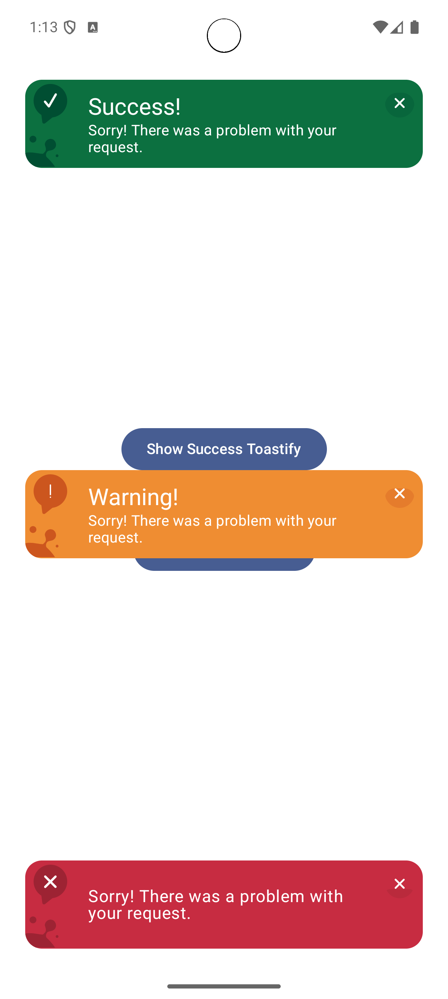

# Toastify - Jetpack Compose

[](https://jitpack.io/#ahmet-ozberk/toastify)
[](https://github.com/ahmet-ozberk/toastify)
[](https://android-arsenal.com/api?level=23)
[](https://github.com/ahmet-ozberk/toastify/blob/main/LICENSE)

Toastify is an elegant and customizable snackbar library for Jetpack Compose. It provides a simple way to show informative messages to your users with different types and positions.

## Demo
<div align="center">
  <video src="https://github.com/user-attachments/assets/c3790024-01b1-44f9-9535-b7aeb03649bc" autoplay loop muted playsinline width="100%">
    
  </video>
</div>

## Features
- 📱 4 Different Types of Toasts:
  - ℹ️ Info
  - ✅ Success
  - ⚠️ Warning
  - ❌ Error
- 🎨 Customizable Design
- ⚡ Easy Integration
- 🔄 Auto-dismiss Support
- 📍 Flexible Position Options

## Installation

### Step 1: Add JitPack repository
Add the following to your root `settings.gradle` file:

```groovy
dependencyResolutionManagement {
    repositoriesMode.set(RepositoriesMode.FAIL_ON_PROJECT_REPOS)
    repositories {
        mavenCentral()
        maven { url 'https://jitpack.io' }
    }
}
```

### Step 2: Add the dependency
Add the dependency to your app module's `build.gradle` file:

```groovy
dependencies {
    implementation 'com.github.ahmet-ozberk:toastify:1.0.0'
}
```

## Usage

### Basic Example
```kotlin
@Composable
fun ExampleScreen() {
    // Create a state for the toastify
    val toastifyState = rememberToastifyState()

    Box(
        modifier = Modifier.fillMaxSize(),
        contentAlignment = Alignment.Center
    ) {
        Button(
            onClick = {
                toastifyState.showToastify(
                    title = "Success!",
                    content = "This is Success toastify!",
                    duration = ToastifyDuration.SHORT,
                )
            }
        ) { 
            Text("Show Success Toastify") 
        }
    }

    // Add the Toastify composable
    Toastify(
        state = toastifyState,
        position = ToastifyPosition.TOP,
        type = ToastifyType.Success,
    )
}
```

### Available Options

#### ToastifyType
- `Success`
- `Error`
- `Warning`
- `Info`

#### ToastifyPosition
- `TOP`
- `BOTTOM`
- `CENTER`


#### ToastifyDuration
- `XSHORT` (1 seconds)
- `SHORT` (3 seconds)
- `NORMAL` (4.5 seconds)
- `LONG` (7 seconds)
- `XLONG` (10 seconds)
- `INFINITE`

## Contribution
Feel free to contribute to this project by:
- 🐛 Reporting bugs
- 💡 Suggesting new features
- 🔧 Submitting pull requests

## License
```
Copyright 2025 Ahmet ÖZBERK

Licensed under the Apache License, Version 2.0 (the "License");
you may not use this file except in compliance with the License.
You may obtain a copy of the License at

    http://www.apache.org/licenses/LICENSE-2.0

Unless required by applicable law or agreed to in writing, software
distributed under the License is distributed on an "AS IS" BASIS,
WITHOUT WARRANTIES OR CONDITIONS OF ANY KIND, either express or implied.
See the License for the specific language governing permissions and
limitations under the License.
```

## Last Updated
- **Date:** 2025-02-26
- **Updated By:** @ahmet-ozberk
